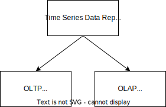

# pattern-language

This guide covers the implementation of an DDD application (tactical design) in Django and with an emphasis on implementation variants Django developers are used to.

This guide does not cover the modelling of an DDD application (strategic design).

To learn more about strategic design I can highly recommend the guides and templates of the [Domain-Driven Design Crew](https://github.com/ddd-crew) on GitHub.

The guide covers how to map strategic design into an implementation in the Django context however.
To make this explicit corresponding sections are post-fixed with "(strategic pattern)".

## Project type patterns


The overall project type is important cause it implies the need for or unsuitability of patterns in a cross-cutting manner.

### Multi user groups

Context:

- You want to provide a web application to several user groups (e.g. related to different companies).

Example:

- SaaS provider of cloud computing resources for different companies (e.g. [codesphere.com](https://codesphere.com)).

### Single user group

Context:

- You want to provide a web application to a single user group.

Examples:

- You are running a learning website for end users (e.g. [udemy.com](https://www.udemy.com)).
- Internal tool for data management in a single team within a company.

### Multi-tenancy

Context:

- You've little requirements w.r.t. security and data separation.

### Single tenancy

Context:

- You've a multi user groups use case and are working in a restricted domain with strict security and data separation requirements (e.g. healthcare, finance).
- You've a single user group use case.

Examples:

- You are provider of cloud resources in the finance domain for companies in the finance industry (e.g. [metalstack.cloud](https://metalstack.cloud)).
- You are running a learning website for end users (e.g. [udemy.com](https://www.udemy.com)).

## Subdomain (strategic pattern)

Core, generic, supporting.

### Core subdomain (stategic pattern)

Context:

- You've identified a high complexity subdomain with your domain experts and your companies market analysts which does differentiate you from competing companies and/or brings you ahead of a competing company.

Problem:

- What tactical DDD patterns should I use to implement a core domain?

Solution:

- In many cases core domains require an implementation with advanced patterns like [Event Sourcing](https://www.martinfowler.com/eaaDev/EventSourcing.html), [CQRS](https://martinfowler.com/bliki/CQRS.html), 

### Generic subdomain (strategic pattern)

Context:

- You've identified a low or medium complexity subdomain with your domain experts which does not differentiate you from competing companies.

Problem:

- Generic subdomains are already/should already be solved.

Solution:‚

- Search reusable Django apps. Good resources are e.g.
  [Django Packages](https://djangopackages.org),
  [best-of-django](https://github.com/fkromer/best-of-django),
  [wsvincent/awesome-django](https://github.com/wsvincent/awesome-django),
  [shahraizali/awesome-django](https://github.com/shahraizali/awesome-django).
- Evaluate if the Django app solves your needs, integrate and customize it (e.g. packaged views) if necessary.

Resulting context (advantages):

- You depend on a third party package.
  You don't have to implement, test and maintain the subdomain yourself.

Resulting context (disadvantage):

- You depend on a third party package.
  The project could end in an unmaintained state.

Implementation examples:

- In many applications Djangos built-in authentication system is not sufficient.
  This subdomain can be implemented using the de-facto standard Django-app [allauth](https://github.com/pennersr/django-allauth).
- Djangos built-in support for emails is suitable for development only.
  The Django-app [django-anymail](https://github.com/anymail/django-anymail) can be used to abstract away email service provider specifics behind a unified API.

## Bounded context (strategic pattern)

Context:

- You've applied domain modelling and came up with a model for a subdomain.

Problem:

- You don't know how to map the bounded context into an implementation in Django.


### Django single app bounded context

Context:

- The bounded context is rather simple.

Solution:

- Map the bounded context to a single Django app.

Example implementation:

```
src
|_ single_app_bounded_context
   |_ admin.py
   |_ models.py
   |_ ...
|_ django_project
   |_ settings
      |_ base.py
      |_ ...
   |_ urls.py
   |_ ...
|_ manage.py
|_ ...
```

### Django multi app bounded context

Context:

- The bounded context is rather complex.

Solution:

- Map the bounded context to several Django apps.

Example implementation:

```
src
|_ multi_app_bounded_context
   |_ app_1
      |_ admin.py
      |_ models.py
      |_ ...
   |_ app_2
      |_ admin.py
      |_ models.py
      |_ ...
|_ django_project
   |_ settings
      |_ base.py
      |_ ...
   |_ urls.py
   |_ ...
|_ manage.py
|_ ...
```

### Django bounded context data separation patterns

Context:

- Data should be private to a single bounded context.
- You want to persist data using Djangos built-in support for SQL databases (SQLite, Postgres, MySQL, ...).

Problem:

- Per-default Django uses a single, shared database. Bounded context specific data is not separated.

#### Bounded context specific database table namespace

Solution:

- Prefix Django database tables (e.g. via corresponding Django models) with an application specific prefix.

Resulting context:

- It's obvious what data relates to what bounded context.
- Data is only "private by convention" (comparable with Python class "dunder" methods).

#### Bounded context specific database schema

Context (additional):

- You use a database for persisting data with support for database schemas:
  Postgres, MySQL, ...
  (You don't use SQLite.)

Solution:

- Use a dedicated database schema (collection of tables) for a single bounded context.

Implementation examples:

Databases with [built-in Django support](https://docs.djangoproject.com/en/5.0/ref/databases/#databases):

- Postgres: [schema](https://www.postgresql.org/docs/current/ddl-schemas.html)
- MariaDB: ?
- MySQL ["database"](https://dev.mysql.com/doc/refman/8.4/en/create-database.html)
- Oracle: ?
- SQLite: SQLite does not support collecting tables relating to a single bounded context in a schema in a database.
  https://stackoverflow.com/a/33962375/5308983
- In-memory SQLite:
  Same as for SQLite. The in-memory database does not support database schemas.

The same what applies to SQLite applies to quite a lot distributed, relational databases as well:

- [rqlite](https://rqlite.io) [github - rqlite/rqlite](https://github.com/rqlite/rqlite)
- [Fly.io LiteFS](https://fly.io/docs/litefs/)
- [dqlite](https://github.com/canonical/dqlite) [github - canonical/dqlite](https://github.com/canonical/dqlite)
- [Turso libsql](https://turso.tech/libsql) / [github - tursodatabase/libsql](https://github.com/tursodatabase/libsql)
- [Cloudflare D1](https://developers.cloudflare.com/d1)

#### Bounded context specific database

Solution:

- Use Djangos built-in support for [multiple databases](https://docs.djangoproject.com/en/5.0/topics/db/multi-db/#multiple-databases).

Example use case:

- Usually personal data is required to be handled with care.
  In many applications the user data of the authentication subdomain is persisted in a separate database.

Resulting context:

- It's obvious what data relates to what bounded context.
- Highest degree of data separation.
- Data can be separated physically.
- Offers most control w.r.t. developer side data access priviledges.

#### Further reading

- [Distributed SQLite: Paradigm shift or hype?](https://kerkour.com/distributed-sqlite): About super fast distributed SQLite, eventual consistency and why the blog auther sticks to Postgres.
- [Emulate database schemas using SQLite](http://jonasbn.github.io/til/sqlite/emulate_schemas.html)

### Further reading

- [martinfowler.com - Bounded Context](https://martinfowler.com/bliki/BoundedContext.html)

## Repository patterns

### Django ORM repository

Context:

- The bounded context you want to model is no CRUD domain.

Solution:

- Add domain models (DTOs) for entities/aggregates (and value objects). One domain model for each entity/aggregate.
- Add Django ORM models for entities/aggregates. One Django ORM model for each entity/aggregate.
- Map fields of entities/aggregate from/to Django models.

Resulting context:

- Django ORM models are not used as domain models as well (Active Record pattern).
- Django ORM models depend on the domain models (dependency inversion).
- Django ORM models are not tightly coupled to data persistence implementations (in-memory, SQLite, Postgres, ...) supported by the Django ORM.
- Application code does not contain persistence specifics anymore.

Resulting context (advantages):

- Application code is decoupled from the data persistence implementation.
- No "fat" Django ORM models anymore.

Example implementation:

Further reading:

- [The Repository Pattern](https://klaviyo.tech/the-repository-pattern-e321a9929f82): Article about an concrete product repository in Python and the impact on client code (in service) readability.
- [Evolution of a Django Repository pattern](https://lukeplant.me.uk/blog/posts/evolution-of-a-django-repository-pattern/): Django repository pattern implementation idea using [Custom QuerySets](https://spookylukey.github.io/django-views-the-right-way/thin-views.html#example-push-filtering-to-the-model-layer) as fluent API instead of many getter methods.

### JSON field repository

Context:

- Mapping between entities/aggregate DTOs and Django ORM models introduces lot of repetitive boilerplate.

Solution:

- Use a single `data = models.JSONField` in the Django model to wrap all entity/aggregate DTO data.

Resulting context (advantages):

- A generic repository can be used for several entities and aggregates.
- There is little need for SQL schema database migrations. Migrating JSON data can be easier.
- Works with noSQL databases as well.
- Writing entities/aggregates should be faster (when using a performant implementation making use of e.g. `pydantic`).

Resulting context (disadvantages):

- Benefits of the Django ORM w.r.t. development workflow (migrations, queries, ...) cannot be used anymore.
- Filtering data from JSONFields might be harder and slower.

Example implementations:

- [Another way to persist DDD Aggregates in Django](https://michalgodkowicz.medium.com/another-way-to-persist-ddd-aggregates-in-django-d148f4cad298):
  Little boilerplate Django ORM to/from `pydantic` entity/aggregate mapping by using a `models.JSONField` to wrap all aggregate/entity data.

### Cached repository pattern

Context:

- Data is mutated rather infrequently.

Problem:

- Every time data is requested from the repository it needs to be fetched from the database.

Solution:

- Cache the data when it's fetched after the first data mutation after cache invalidation.
- Invalidate the cache if data is mutated via the write part of the repository.

Resulting context (advantages):

- Cached data reads are way faster.

Resulting context (disadvantages):

- Latency for data fetches varies significantly.
- Data writes might be a bit slower.

Example implementations:

- [Repository Pattern with Caching and Hangfire in ASP.NET Core](https://codewithmukesh.com/blog/repository-pattern-caching-hangfire-aspnet-core/)

### Time series data repository patterns



#### OLTP use cases

Context:

- You've a [Online transaction processing (OLTP)](https://en.wikipedia.org/wiki/Online_transaction_processing)
  use case (need for data manipulation like creation, update and deletes). CRUD use cases with moderate need for R.

Example:

- You want to create a web application for data management and mutation of time series data.

Implementation example:

- Implementation making use of [QuestDB](https://github.com/questdb/questdb) and [Python Client](https://questdb.io/docs/clients/ingest-python/) for data persistency.

#### OLAP use cases

Context:

- You've a [Online analytical processing (OLAP)](https://en.wikipedia.org/wiki/Online_analytical_processing)
  use case (a lot of data, fast read performance, no need for data manipulation). CRUD use cases without CUD and high need for R.

Example:

- You want to create a web application dashboard for business analysis.

Implementation example:

- Implementation making use of [TimescaleDB](https://github.com/timescale/timescaledb) and [`psycopg2` lib](https://docs.timescale.com/quick-start/latest/python/) for data persistency.
- Implementation making use of [CrateDB](https://github.com/crate/crate) and [Python Client](https://cratedb.com/docs/python/en/latest/index.html) for data persistency.

#### Inspiration

- [IBM Technology - OLAP vs OLTP](https://www.youtube.com/watch?v=iw-5kFzIdgY)
- [GitHub search for "database olap"](https://github.com/search?q=database+olap&type=repositories&s=stars&o=desc)
- [GitHub search for "database oltp"](https://github.com/search?q=database+oltp&type=repositories&s=stars&o=desc)

### Inspiration

- Architecture patterns with Python: A non-generic [repository pattern](https://www.cosmicpython.com/book/chapter_02_repository.html#_introducing_the_repository_pattern) and [Unit of work pattern](https://www.cosmicpython.com/book/chapter_06_uow.html#_the_unit_of_work_collaborates_with_the_repository) for [Django](https://www.cosmicpython.com/book/appendix_django.html).
- [The repository pattern via CQRS with Python/Django/Elasticsearch](https://douwevandermeij.medium.com/the-repository-pattern-via-cqrs-with-python-django-elasticsearch-cb38437721d3): *Compound repository pattern* separates read and write part of a repository. *Specification pattern* for narrowing the interface of the repository `find` method.
- [Red Bird](https://github.com/Miksus/red-bird): Repositories (SQL -> SQLAlchemy, MongoDB, in-memory, CSV, ... ) for Python.
- [.NET Entity Framework Core 8.0 DbContext](https://learn.microsoft.com/en-us/dotnet/api/microsoft.entityframeworkcore.dbcontext?view=efcore-8.0): A DbContext instance represents a session with the database and can be used to query and save instances of your entities. DbContext is a combination of the Unit Of Work and Repository patterns.
- [Spring Data](https://spring.io/projects/spring-data): Provides repository and object-mapping abstractions and implementations (CrudRepository, PagingAndSortingRepository, ReactiveCrudRepository, ...) for the Java Spring framework.
- [DAO vs Repository Patterns](https://www.baeldung.com/java-dao-vs-repository): A try to distinguish the DAO (Data Object) pattern from repository pattern.

### Repository specification pattern

Problem:

The interface of repository classes (abstract + concrete) tends to get broad.

Solution:

Keep the interface of the repository class interface and it's concrete implementations narrow.
Do not implement several `get()` and `get_all()` query methods or adding several paramaters to single `get()` and `get_all()` query methods.
Define a single `get()` and `get_all()` method with a single parameter `specification` instead and pass the complete filter and sorting meta data via this parameter.

Inspiration for implementation variants:

- [fractal-specifications](https://github.com/douwevandermeij/fractal-specifications): Implementation of the specification pattern with [Django support](https://github.com/douwevandermeij/fractal-specifications?tab=readme-ov-file#django) for [narrowing the repository pattern interface](https://douwevandermeij.medium.com/specification-pattern-in-python-ff2bd0b603f6).
- [Specification](https://github.com/ardalis/Specification): Base class for adding specifications to a DDD model in C# .NET (EF6 and EF Core).

### Unique identifier alternatives

Keep an eye out for domain specific identifiers.
In most cases it makes sense to use them to identify model instances or (aggregate root) entities in the domain model.
Fallback to some kind of randomly generated ID format as fallback.

#### Domain specific unique identifiers

- Books are uniquely identified by [International Standard Book Number (ISBN)](https://en.wikipedia.org/wiki/ISBN). The ISBN can be used as unique identifier in the e-commerce domain.
- Car models are uniquely identified by [Vehicle Identification Number (VIN)](https://en.wikipedia.org/wiki/Vehicle_identification_number). The VIN can be used in domains where car models are relevant.
- ...

#### Random ID formats

- [uuid-utils](https://github.com/aminalaee/uuid-utils): Wrapper for Rust implementations of `uuid1`, `uuid2`, `uuid3`, `uuid4`, `uuid5`, `uuid6`, `uuid7` and `uuid8`.
- [py-nanoid](https://github.com/puyuan/py-nanoid): Python implementation of [Nano IDs](https://github.com/ai/nanoid).

Further reading:

- [UUIDs Are Bad for Database Index Performance, enter UUID7!](https://www.toomanyafterthoughts.com/uuids-are-bad-for-database-index-performance-uuid7/): Insert performance (disk writes vs rows written ) comparison for SQLite, MariaDB (MySQL) and PostgreSQL ([code](https://github.com/vdorot/primary_key_io)).
- [The Problem with Using a UUID Primary Key in MySQL](https://planetscale.com/blog/the-problem-with-using-a-uuid-primary-key-in-mysql): Bad insert performance. Higher storage utilization.

## Bounded context integration patterns

### Context mapping (stategic pattern)

Integration between subdomains/bounded contexts involves the strategic pattern *context mapping*.

[ddd-crew/context-mapping](https://github.com/ddd-crew/context-mapping)

### Partnership

Solution:

- Bounded contexts are integrated in an ad hoc manner.

### Shared kernel

Context:

- Bounded contexts share a limited overlapping model.

### Conformist

Solution:

- The consumer conforms to the service provider’s model.

### Anticorruption layer

Solution:

- The consumer translates the service provider’s model into a model that fits the consumer’s needs.

### Open-host service

Solution:

- The service provider implements a published language—a model optimized for its consumers’ needs.

### Separate ways

Solution:

- Duplicate particular functionality (violate against DRY principle by intention) in several subdomains/bounded contexts.

### Further reading

- [Learning Domain-Driven Design - Chapter 4. Integrating Bounded Contexts](https://www.oreilly.com/library/view/learning-domain-driven-design/9781098100124/ch04.html)

## In-memory database

For various functionalities like e.g. caching we depend on in-memory databases.

### Redis

One first implementation is [Redis](https://github.com/redis/redis)  which has been and is probably still the de-facto standard.
For production we can choose from a variety of fully managed service providers.

- [Redis Cloud](https://redis.io/cloud/)
- [Upstash for Redis](https://upstash.com/docs/redis/overall/getstarted) (PaaS [fly.io](https://fly.io) provides [integration](https://fly.io/docs/reference/redis/))

### Dragonfly

[dragonfly](https://github.com/dragonflydb/dragonfly) is a drop-in replacement for Redis.
Dragonfly is compatible with the Redis API.
Dragonfly is easier to manage and seems to be way faster however.
For local development you can install it as [binary](https://www.dragonflydb.io/docs/getting-started/binary),
use the [Docker container](https://www.dragonflydb.io/docs/getting-started/docker) e.g. with a [Docker Compose file](https://www.dragonflydb.io/docs/getting-started/docker-compose)
or in a local Kubernetes cluster with [Helm Chart](https://www.dragonflydb.io/docs/getting-started/kubernetes).

For production it's easiest to use the fully managed [Dragonfly Cloud](https://www.dragonflydb.io/cloud) service.

## Inspiration

### Django specific (DDD)

- [Decoding DDD: A Three-Tiered Approach to Django Projects](https://www.youtube.com/watch?v=72V-5hrilv0) - Lessons learned from refactoring a big learning management system (LMS) using DDD in a 3 level approach: level 0 (ubiquitous language, bounded contexts), level 1 (anemic domain model, value object, aggregate, domain service), level 2 (repository pattern).
- [Saving Django Legacy Projects Using Domain-Driven Design](https://betterprogramming.pub/saving-django-legacy-project-using-ddd-f1e709795291): Article with diagrams and file structure.
- [DjangoCon Video about DDD with GraphQL backend/frontend integration implementation](https://www.youtube.com/watch?v=VzU9HdH3MZM)
- [DjangoCon video about integrating some DDD tactical patterns in OSIS, a long-term open-source project for UCLouvain university](https://www.youtube.com/watch?v=t5DBiKsjvS4)
- [Introduction slides into DDD with Django using a ride sharing use case as example](https://slides.com/mafinarkhan/ddddd)
- [Intro slides into how to implement Domain Driven Design from the Université catholique de Louvain student management system maintainer](https://sebcorbin.github.io/ddddjango/)
- [Django API Domains](https://phalt.github.io/django-api-domains/)
- [django-ddd](https://github.com/jdiazromeral/django-ddd): Django the DDD way
- [django-cqrs](https://github.com/cloudblue/django-cqrs): Django application, that implements CQRS data synchronization between several Django micro-services
- [django-outbox-pattern](https://github.com/juntossomosmais/django-outbox-pattern): Django application implementing the [transactional outbox pattern](https://microservices.io/patterns/data/transactional-outbox.html).
- [lily](https://github.com/cosphere-org/lily): DDD inspired microservice framework based on Django and DRF
- [ddddjango](https://github.com/SebCorbin/ddddjango): Slides on implemeting DDD in Django.
- [ddd-python-django](https://github.com/johnnncodes/ddd-python-django): Attempt to implement DDD and hexagonal architecture in Python using Django

### Django specific (general)

- [awesome-django](https://github.com/wsvincent/awesome-django)
- [awesome-django-admin](https://github.com/originalankur/awesome-django-admin)
- [best-of-django](https://github.com/fkromer/best-of-django)

- [Django Styleguide](https://github.com/HackSoftware/Django-Styleguide)
- [High Performance Django](https://lincolnloop.com/high-performance-django/build.html)
- [django-th](https://github.com/foxmask/django-th): A communication bus in Django.
- [falco](https://github.com/Tobi-De/falco): Skaffolding modern Django projects.
- [hydra](https://github.com/Lightmatter/django-hydra): A django/htmx/alpine/tailwind project template.
- [django-microservices](https://github.com/lander2k2/django-microservices): An attempt to build microservices with Django.
- [django-jaiminho](https://github.com/loadsmart/django-jaiminho): A broker agnostic implementation of outbox and other message resilience patterns for Django apps.
- [django-htmx-patterns](https://github.com/spookylukey/django-htmx-patterns)
- [Django Views - The Right Way](https://github.com/spookylukey/django-views-the-right-way)
- [django-htmx-alpine](https://github.com/arcanemachine/django-htmx-alpine)
- [awesome-python-typing](https://github.com/typeddjango/awesome-python-typing)
- [Django + Vue + Vite: REST Not Required](https://ilikerobots.medium.com/django-vue-vite-rest-not-required-ca63cfa558fd): An intro about [cookiecutter-vue-django](https://github.com/ilikerobots/cookiecutter-vue-django) and how to use it to create API-less Django projects with vite + vue.

### Python specific

- [sutoppu](https://github.com/u8slvn/sutoppu): Python specification pattern implementation
- [eventsourcing](https://github.com/pyeventsourcing/eventsourcing): Eventsourcing in Python.
- [py_assimilator](https://github.com/knucklesuganda/py_assimilator): A collection of patterns (Repository, Unit of work, specification, specialization list, lazy command) for in-memory dict, Redis (in-memory), SQLAlchemy (SQL), MongoDB (NoSQL) databases.
- [ddd-for-python](https://github.com/runemalm/ddd-for-python): A domain-driven design framework using Sanic.
- [python-ddd](https://github.com/qu3vipon/python-ddd): FastAPI Domain-Driven-Design (DDD) Example.
- [dddpy](https://github.com/iktakahiro/dddpy): FastAPI DDD example.
- [Minos](https://github.com/minos-framework): Framework for creating reactive microservices in Python
- [Building Python Microservices with FastAPI](https://github.com/PacktPublishing/Building-Python-Microservices-with-FastAPI)
- [clean-code-python](https://github.com/zedr/clean-code-python): Clean Code concepts (SRP, OCP, LSP, ISP, DIP, DRY) adapted for Python.
- [dtm](https://github.com/dtm-labs/dtm): A distributed transaction framework, supports workflow, saga, tcc, xa, 2-phase message, outbox patterns, supports many languages (including Python API).
- [BullMQ](https://github.com/taskforcesh/bullmq): Message Queue and Batch processing for NodeJS and Python based on Redis.
- [NSQ](https://github.com/nsqio/nsq): Realtime distributed messaging (at least once, un-ordered) platform usable with [Python client libs](https://nsq.io/clients/client_libraries.html).
- [NATS](https://nats.io): Distributed messaging (at most once / at least once / exactly once) usable with [Python client](https://github.com/nats-io/nats.py).

### Generic DDD

- [awesome-ddd](https://github.com/heynickc/awesome-ddd): A curated list of Domain-Driven Design (DDD), Command Query Responsibility Segregation (CQRS), Event Sourcing, and Event Storming resources.
- [ddd-dynamic](https://github.com/valignatev/ddd-dynamic): Resources about Domain Driven Design in Python, Ruby and other dynamic languages.
- [awesome-software-architecture](https://github.com/mehdihadeli/awesome-software-architecture)

### Other programming languages

- [MassTransit](https://github.com/MassTransit/MassTransit): Distributed Application Framework for .NET
- [Apache RocketMQ](https://github.com/apache/rocketmq): Financial grade transactional messages.
- [Apache Pulsar](https://github.com/apache/pulsar): Distributed pub-sub messaging with strong ordering and consistency guarantees.

### Deployment

- [free-for-dev](https://github.com/ripienaar/free-for-dev)
- [awesome-digitalocean](https://github.com/jonleibowitz/awesome-digitalocean)
- [awesome-heroku](https://github.com/ianstormtaylor/awesome-heroku)

### Stategic DDD

- [DDD RE-DISTILLED](https://speakerdeck.com/thirion/ddd-re-distilled): Slides summarizing the concepts contained in the "Domain-driven Design Distilled" book.
